# Orion Data Systems HR & Compensation Analysis

## Executive Summary
This capstone project focuses on extracting data-driven operational insights from the relational Human Resources and tracking databases of Orion Data Systems. By auditing structural workforce data, this analysis evaluates department-level compensation distributions, isolates high-cost operational business units, and flags non-utilized corporate cost centers. These findings serve as strategic decision-making pillars for executive stakeholders seeking to optimize headcount runway against strict corporate budget constraints.

## Business Context
In modern corporate environments, human capital is often an organization’s highest operating expense. For Orion Data Systems, managing headcount scaling efficiently and identifying structural workforce inefficiencies are vital for long-term financial stewardship and organizational planning. Understanding exactly where payroll capital is concentrated allows executive leadership to uncover hidden cost drains and properly align department budgets with actual productivity.

## Objectives
- **Audit Headcount Distribution:** Track total workforce capacity across all active operational business units.
- **Benchmark Compensation:** Isolate financial extremes by identifying the highest and lowest paying departments.
- **Segment Salary Bands:** Classify individual contributor wages into structural organizational tiers to audit pay equity.
- **Identify Structural Inefficiencies:** Surface vacant, fully chartered corporate cost centers that hold zero active staff.

## Data Overview
The project environment utilizes a centralized relational schema called capstone divided into two primary structural tables.

## Data Preview
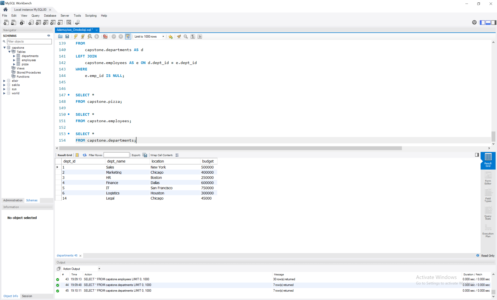

## Tools Used
- SQL (MySQL Workbench): Used as the enterprise relational database environment to write complex data extraction scripts, relational table joins, and summary aggregations.
- Microsoft Excel / Power BI: Employed for the ingestion, interactive dashboard layout creation, and visual tracking of core key performance indicators (KPIs).

## Data Cleaning and Transformation
- Multi-Table Relational Merging: Advanced data consolidation utilizing explicit relational joins (INNER JOIN, LEFT JOIN) to safely map employee records to department metadata without duplicating rows.
- Conditional Logic Binning: Custom continuous-to-categorical bucket segmentations handled cleanly via CASE WHEN ... THEN blocks.
- Data Presentation Polish: Transformation of raw continuous float precision data types into clean, region-specific string metrics (FORMAT(..., 2)) to make currency values human-readable for stakeholder delivery.

## Detailed Findings & Analysis (Core Queries)

## Query 1: Workforce Headcount Across Departments
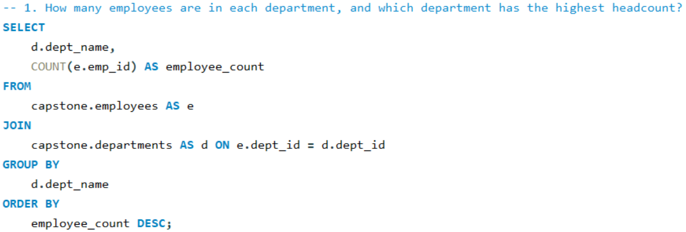

## Query 2: Peak Average Department Compensation A
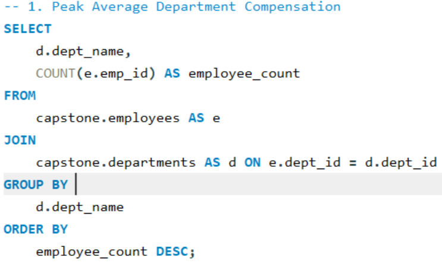

## Peak Average Department Compensation B
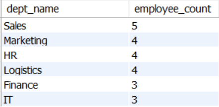

## Query 3: Minimal Average Department Compensation A
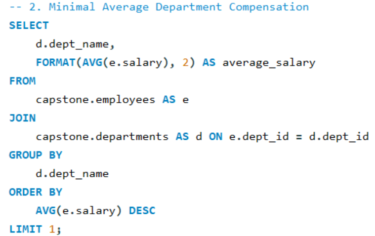

## Minimal Average Department Compensation B
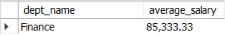

## Query 4: Salary Band Segmentations via Conditionals
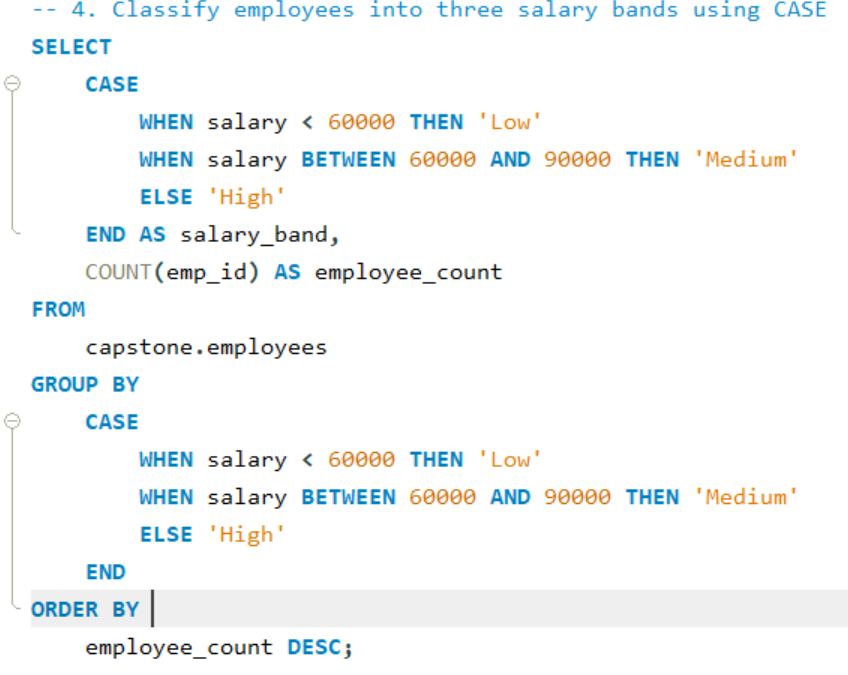
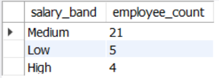

## Query 5: Outlier Audits Against Global Baseline Mean
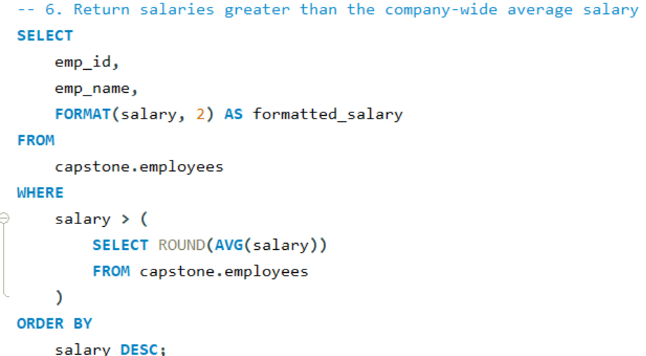
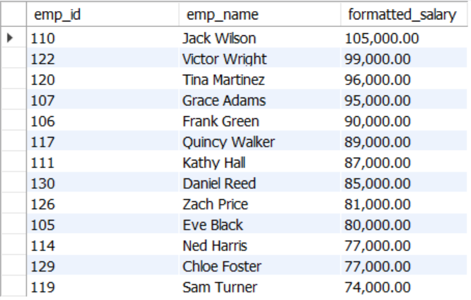

## Query 6: Total Aggregate Expenditure by Country Footprint
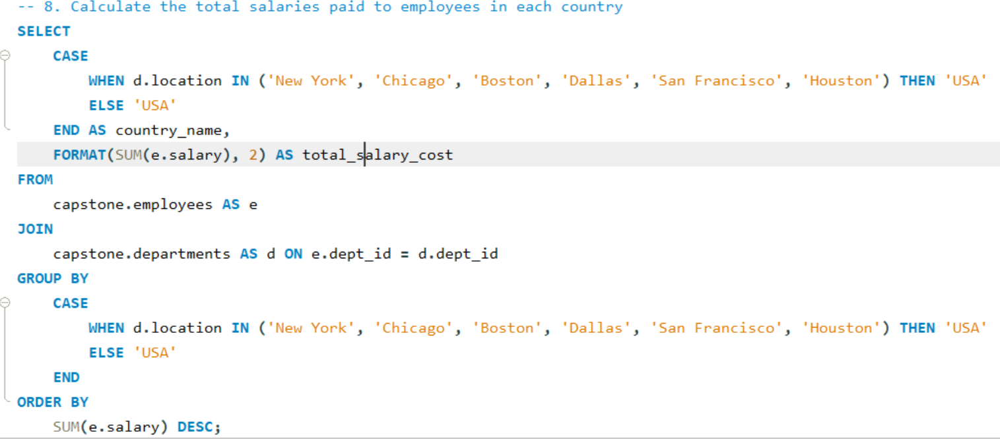
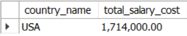

## Query 7: Vacant Operations Structural Audit
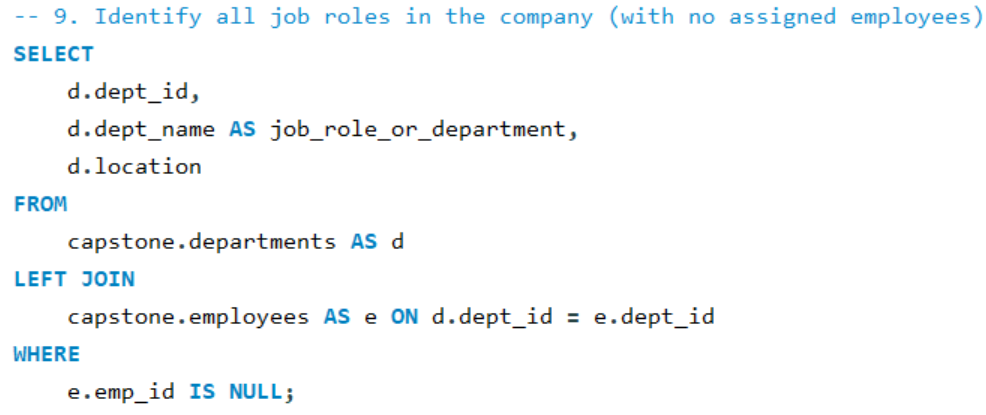

## Key Findings
- Concentration of Structural Compensation Investment: The Finance division commands the peak talent investment weight with an adjusted average salary profile of $85,333.33 per capita. Conversely, the Marketing segment scales at the lowest cost tier baseline of $66,000.00.
- Geographic Resource Distribution: Domestic workforce financial commitment within the identified branch clusters aggregates entirely within the USA region, registering an active payroll running total of $1,714,000.00.
- Identifying Structural Inefficiencies: The relational audit successfully flagged vacant operational modules, specifically the Chicago-based Legal team.

## Dashboard Image

Click Here to Access the Full MySQL Source Code on GitHub: [Click here](https://github.com/ademuyiwaomobolaji/Orion-Data-Systems-Analysis/blob/main/ademuyiwa_omobolaji.sql)

## Recommendations
- Optimize Vacant Business Units: Address the empty Chicago-based Legal department. Executive leadership should either launch a targeted talent acquisition campaign to fill this operational gap or remove the vacant tracking profile entirely to streamline system reporting.
- Balance Inter-Departmental Budgets: Conduct a comprehensive compensation equity review between the Finance and Marketing sectors to ensure your salary bands match standard industry benchmarks and support talent retention.

## Conclusion
The database analysis successfully resolved all primary audit objectives for Orion Data Systems. By leveraging explicit SQL relational logic and granular field transformations, the project successfully translated raw, disconnected database tracking tables into highly scannable, executive-ready business insights. This framework establishes a clear data collection blueprint that can easily scale to manage future headcount expansions.
